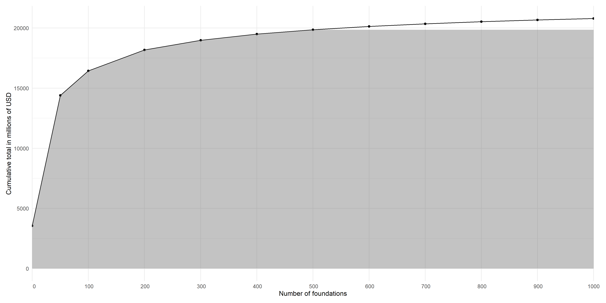

# Exploratory data analysis

Here, we will carry out exploratory data analysis of grants to obtain a sense of how money has been allocated across threats and taxonomic groups

Read in excel sheets for grants awarded by the top 1000 foundations and the list of classified grants for exploratory data analysis
```{r}
funders_top1000 <- read_csv("data/data-list-of-top1000-donors-by-money.csv")
data <- read_csv("data/classified-grants-for-analysis.csv")
```

Below we visualize overall funding provided by the top 1000 grantmakers (Supplementary Fig S1 - Accumulation of Funding Across Top Grantmakers)
```{r}
money_accum <- function(x) {
  funders_top1000 %>%
    group_by(`Number`) %>%
    summarise(total = sum(`Amount Funded`)) %>%
    arrange(desc(total)) %>%
    slice(1:x) %>%
    dplyr::select(total) %>%
    sum(na.rm = TRUE)
}

rank <- c(0,50,seq(100,1000,100))
money <- sapply(rank, money_accum)

top_funders <- data.frame(n_funders = rank, tot_money_mil = money/1e6)

fig_top_funders <- ggplot(top_funders, aes(x = n_funders,
                                           y = tot_money_mil,
                                           group = 1)) +
  geom_line() +
  geom_point() +
  geom_area(aes(y=ifelse(tot_money_mil< top_funders[7,2], tot_money_mil, top_funders[7,2])),
            fill="#696969", alpha = .4) +
  theme_minimal() +
  xlab("Number of foundations") +
  ylab("Cumulative total in millions of USD") +
  scale_x_discrete(limits = rank[-2])+
  theme(plot.margin = margin(10,20,10,10))


fig_top_funders

# % Money captured by top 500 funders = 95.5%
top500 <- money[7]/money[12]
top500

ggsave(fig_top_funders, filename = "figs\\fig_topGrantmakers_funding.png", 
       height = 7, width = 14, device = png(), units="in", dpi = 300)

```

```{r ,eval=TRUE, fig.cap="Accumulation curve of the funding in our dataset across the top 1000 grantmakers. The shaded region encompasses the amount of funding captured by the top 500 grantmakers, which represents more than 95.5% of the total amount of funding."}
# show exported image

```

Now, let's look at how many grants were classified across multiple threat categories and what proportion of money they retained
```{r}
threat <- data[,c(1:10, 37:42)] %>% 
  mutate(sumAcross = cat_threat_climate + cat_threat_energytransport + 
           cat_threat_habitat + cat_threat_inv_spec + cat_threat_overexp + 
           cat_threat_pollution) %>%
  filter(sumAcross > 0)

# Checking number of grants/money for multiple threat category grants
tot_threat <- sum(threat$Grant.Amount, na.rm = T) 

# Four or more threats retained 99.99% of money
threat4 <- threat %>%
  filter(sumAcross <= 4)
nrow(threat4)/nrow(threat)
sum(threat4$Grant.Amount,na.rm = T)/tot_threat

# Three threats retains 99.3% of the money
threat3 <- threat %>%
  filter(sumAcross <= 3)
nrow(threat3)/nrow(threat)
sum(threat3$Grant.Amount,na.rm = T)/tot_threat

# Two threats retained 96% of the money
threat2 <- threat %>%
  filter(sumAcross <= 2)
nrow(threat2)/nrow(threat)
sum(threat2$Grant.Amount, na.rm = T)/tot_threat

# Unique threat categories retained 80.3% of the money
threat1 <- threat %>%
  filter(sumAcross <= 1)
nrow(threat1)/nrow(threat)
sum(threat1$Grant.Amount,na.rm = T)/tot_threat
```

Plot multiple threat categories and grants
```{r plot multi-threats, eval=FALSE}
n_threats <- 1:4
n_threat_grants <- c(nrow(threat1), 
                     nrow(threat2) - nrow(threat1), 
                     nrow(threat3) - nrow(threat2),
                     nrow(threat4) - nrow(threat3))

threats <- data.frame(n_threats, n_threat_grants)

fig_threats_grants <- ggplot(threats, aes(x = n_threats, y = n_threat_grants)) +
  geom_line() + theme_bw() +
  labs(title = "Number of grants across multiple Threat Categories",
       x="Number of threat categories", y="Number of grants")

plot(fig_threats_grants)

# save as png
ggsave(fig_threats_grants, filename = "figs/fig_threats_grants.png", 
       height = 7, width = 12, device = png(), dpi = 300); dev.off()

```

```{r, eval=TRUE, fig.cap="Number of grants that were classified into one or more categories of threat"}
# show exported image
knitr::include_graphics("figs/fig_threats_grants.png")
```

Following the above analysis, we decided to retain grants classified across multiple threat categories for the network analysis alone. 
