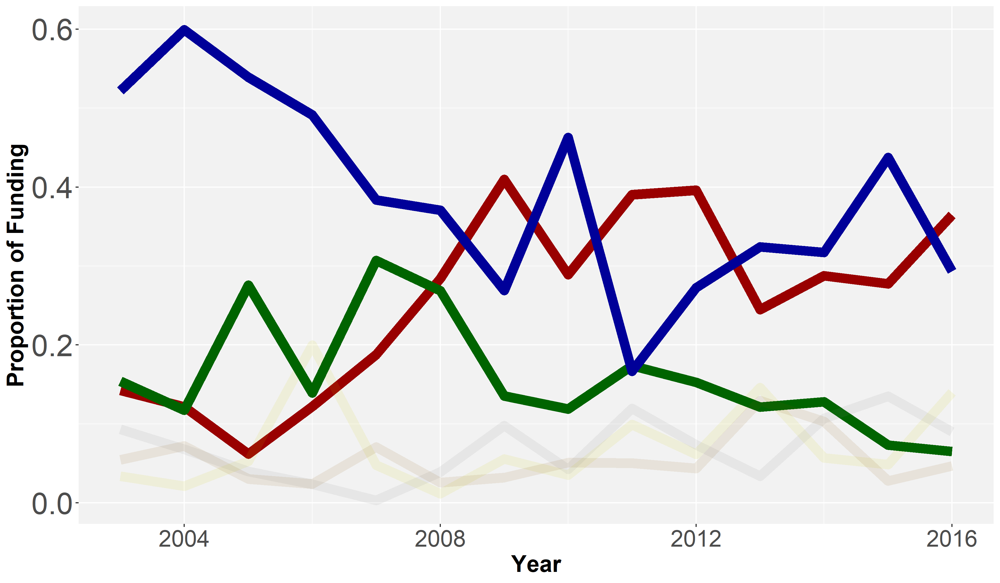

# Temporal trends in conservation funding

```{r eval=TRUE}
# Load libraries
library(tidyverse)
library(scales)
library(ggsci)
```

Importing data
```{r, eval=TRUE}
# Read in data of post-processed grants
data <- read_csv("data\\post-processed-grants-for-analysis-unique.csv") %>%
   as.data.frame() %>%
   dplyr::select(c(1:42, 49:109, 43:48))
```

Data on funding
```{r}
# Single Category Data
money.data <- data[,11:(length(data)-6)]*data[,7]
money.data <- mutate(money.data,
                         Year.Authorized = data$Year.Authorized,
                         Num.Thr = data$Num.Thr,
                         Num.Tax = data$Num.Tax)

by.year.money <- money.data %>%
  group_by(Year.Authorized) %>%
  summarize_at(vars(cat_act_area:cat_taxa_other), sum, na.rm = TRUE) %>%
  pivot_longer(-Year.Authorized, names_to = "Category", values_to = "Amount") %>%
  group_by(Year.Authorized) %>%
  mutate(ann.percent = Amount/sum(Amount)) %>%
  group_by(Category) %>%
  mutate(percent = Amount/sum(Amount))
```

Categories used for analysis
```{r, echo = FALSE}
u.threat_cat <- names(data)[37:42]

u.threat_list <- c("Climate Change", 
                   "Energy/Transportation",
                   "Habitat Loss",
                   "Invasive Species",
                   "Overexploitation",
                   "Pollution")
```

Fig. 2: A. Temporal variation (2003-2016) in proportion of funding across unique threat categories per year
```{r fig-2a}
fig.2a.data <- by.year.money %>%
  filter(Category %in% u.threat_cat) %>%
  group_by(Year.Authorized) %>%
  mutate(ann.percent = Amount/sum(Amount),
         alpha = rep(c(1,.5), 3))

fig.2a.plot <- ggplot(fig.2a.data, 
                aes(y = ann.percent, 
                    x = Year.Authorized)) +
  geom_line(size = 4, aes(color = Category, alpha = alpha), show.legend = F) +
  scale_color_manual(values = cat_colors22[c(1,13,11,20,5,18)],
                     name="Threat Category",
                     labels=u.threat_list) +
  labs(x="Year",
       y="Proportion of Funding") +
       # title="Proportion of Funding") +
  theme(panel.background = element_rect(fill = "grey95"),
        axis.title = element_text(size=20, face = "bold"),
        axis.text.x = element_text(size = 20),
        axis.text.y = element_text(size = 26))

ggsave(fig.2a.plot, filename = "figs\\Fig2A.png", width=12, height=7,device = png(), units="in",dpi = 300)

```

```{r,eval=TRUE, fig.cap='Figure 2A - Temporal variation (2003-2016) in proportion of funding across unique threat categories per year'}
# show exported image

```

Fig.2: B.Temporal variation in overall allocation of money across unique threat categories per year
```{r fig-2b}
fig.2b.data <- by.year.money %>%
  filter(Category %in% u.threat_cat)

fig.2b.plot <- ggplot(fig.2b.data, 
                aes(y = Amount, 
                    x = Year.Authorized,
                    color = Category)) +
  geom_line(size = 2, linetype = 1) +
  theme_minimal() +
  scale_color_manual(values = cat_colors22[c(1,13,11,20,5,18)],
                     name="Threat Category",
                     labels=u.threat_list) +
  labs(x="Year", 
       y="Money (USD Million)") + 
  scale_y_continuous(breaks = c(0,25e6,50e6,75e6,10e7),
                     labels = c("0","25","50","75","100"),
                     position = "right") +
  theme(axis.text = element_text(size = 14),
        axis.title = element_text(size = 16, face = "bold"),
        legend.title = element_text(size = 14),
        legend.text = element_text(size = 12),
        legend.key.width = unit(1,"cm"),
        legend.spacing.x = unit(1,"cm"),
        legend.position = "bottom")

ggsave(fig.2b.plot, filename = "figs\\Fig2B.png", width=12, height=7,device = png(), units="in", dpi = 300)
```

```{r, eval=TRUE, fig.cap='Figure 2B - Temporal variation (2003-2016) in overall allocation of money across unique threat categories per year'}
# show exported image
knitr::include_graphics("figs/Fig2B.png")
```

