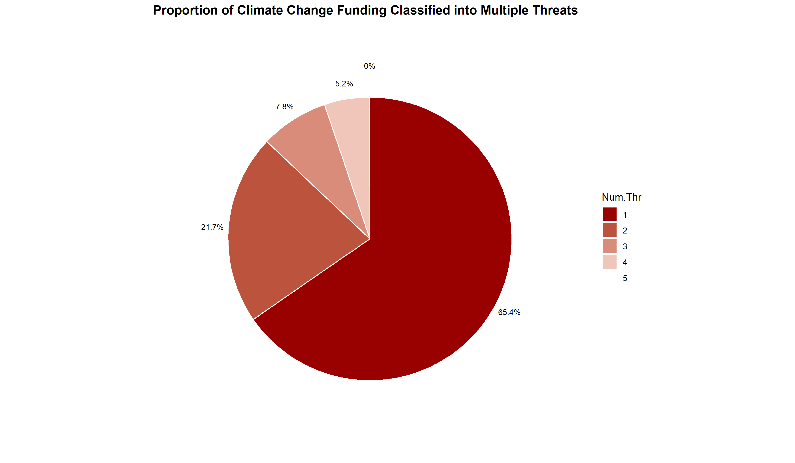
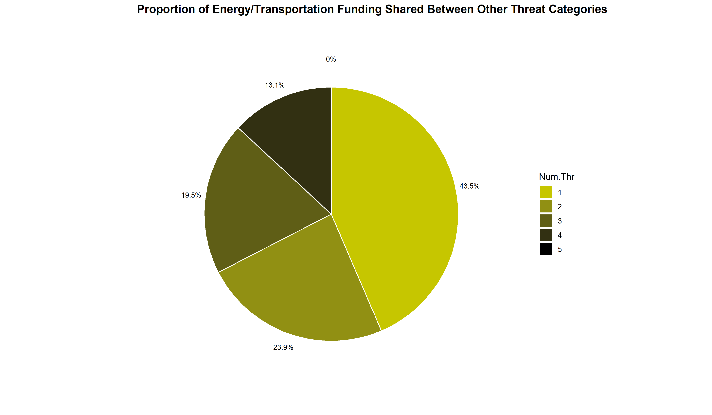
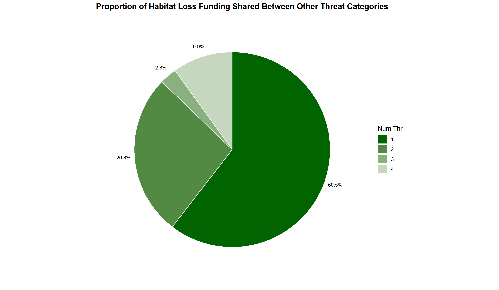
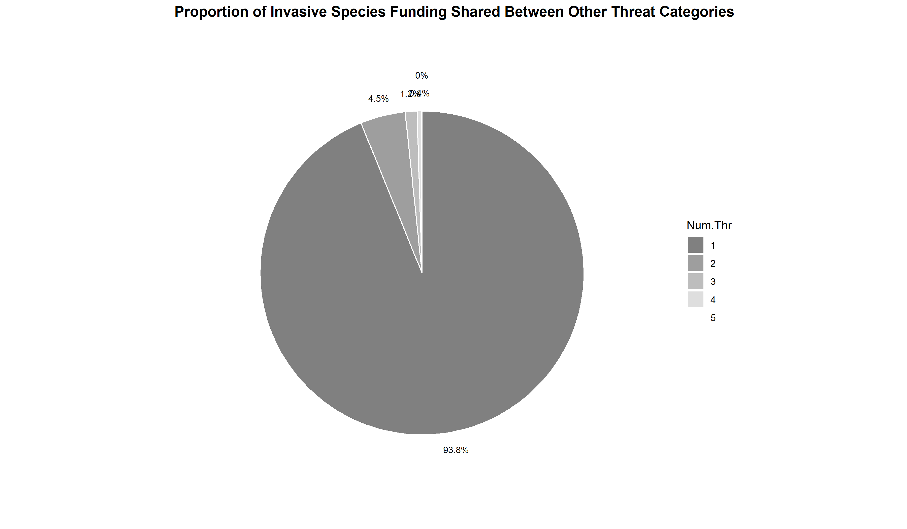

# Network Analysis

```{r eval=TRUE}
# Load libraries
library(tidyverse)
library(scales)
library(ggsci)
```

```{r}
data <- read_csv("data\\post-processed-grants-for-analysis-unique.csv") %>%
  as.data.frame()

data.multi <- read_csv("data\\post-processed-grants-for-analysis-multi.csv") %>%
  as.data.frame()
```

Calculate the overlap in funding between threat categories
```{r, include=FALSE}
threat.net1 <- data %>%
  dplyr::select(cat_threat_climate_energytransport:cat_threat_overexp_pollution) %>%
  map2_df(colnames(.), ~  c(NA, .y)[.x +1]) # Change the binary 1 values into the column heaers)
threat.net2 <- data %>%
  dplyr::select(Grant.Amount, Num.Thr, Description, Keywords)
threat.net3 <- bind_cols(threat.net2, threat.net1)

threat.net4 <- threat.net3 %>%
  filter(Num.Thr == 2) %>%
  unite("joint_cat",
        cat_threat_climate_energytransport:cat_threat_overexp_pollution, 
        na.rm = TRUE, remove = FALSE) %>%
  dplyr::select(joint_cat, Grant.Amount, Description, Keywords) %>%
  group_by(joint_cat) %>% 
  summarize(total = sum(Grant.Amount)) %>%
  mutate(p = total/sum(total))

write_csv(threat.net4, "data\\threat-network-data.csv")
```

The above overlap in funding data was used in Python to run the network analysis followed by creation of piecharts within R
```{python}
import numpy as np
import pandas as pd
import igraph as ig
import chart_studio.plotly as py
import plotly.graph_objs as go
from plotly.offline import download_plotlyjs, init_notebook_mode, plot, iplot
from IPython.display import Image

# Helper functions
def dist(A, B):
    return np.linalg.norm(np.array(A)-np.array(B))

def get_idx_interv(d, D):
    k=0
    while(d>D[k]): 
        k+=1
    return  k-1

def deCasteljau(b,t): 
    N=len(b) 
    if(N<2):
        raise InvalidInputError("The  control polygon must have at least two points")
    a=np.copy(b) #shallow copy of the list of control points 
    for r in range(1,N): 
        a[:N-r,:]=(1-t)*a[:N-r,:]+t*a[1:N-r+1,:]                             
    return a[0,:]

def BezierCv(b, nr=5):
    t=np.linspace(0, 1, nr)
    return np.array([deCasteljau(b, t[k]) for k in range(nr)])

Dist=[0, dist([1,0], 2*[np.sqrt(2)/2]), np.sqrt(2), dist([1,0],  [-np.sqrt(2)/2, np.sqrt(2)/2]), 2.0]
params=[1.2, 1.5, 1.8, 2.1]

# Read the data file
df = pd.read_csv('data/threat-network-data.csv')
categories = list(set(df['A'].tolist() + df['B'].tolist()))

# Remove edges which have a contribution of less than 2000000
df.loc[df['n'] <  2000000, 'n'] = 0.0
```

Create the graph network
```{python}
g = ig.Graph.Full(len(categories))
g.vs['name'] = categories
g.es["weight"] = 0.0

for idx, row in df.iterrows():
    if row['A'] == row['B']:
        continue
    # Scale the contribution by a factor of 60000
    g[row['A'], row['B']] += row['n']/60000.0
g.es.select(weight=0.0).delete()

layt = g.layout('circular') #circular layout
Weights = list(map(int, g.es["weight"]))
V=list(g.vs)
labels=[v['name']  for v in V]
E=[e.tuple for e in g.es]# list of edges

node_color=['#FF0000' for v in g.vs] 
line_color=['rgb(342,342,342)' for v in g.vs]
edge_colors=['#000000','#000000', '#000000', '#000000']

Xn=[layt[k][0] for k in range(len(layt))]
Yn=[layt[k][1] for k in range(len(layt))]

lines=[] # the list of dicts defining edge Plotly attributes
edge_info=[] # the list of points on edges where the information is placed

# Percentage contrbutions of every category
marker_size_dict = {}
marker_size_dict['OE'] = 0.3588109538682985
marker_size_dict['IS'] = 0.08341313937829264
marker_size_dict['CC'] = 0.3027677823015496
marker_size_dict['ET'] = 0.08004130412646482
marker_size_dict['P'] = 0.052836471758225034
marker_size_dict['HL'] = 0.1221303485671694

# Marker sizes based on Percentage contributions
threat_marker_size = []
for label in labels:
    threat_marker_size.append(marker_size_dict[label])
for idx in range(len(threat_marker_size)):
    threat_marker_size[idx] = np.log(threat_marker_size[idx]*100)*40
```

Plot the network analysis 
```{python}
for j, e in enumerate(E):
    A=np.array(layt[e[0]])
    B=np.array(layt[e[1]])
    d=dist(A, B)
    K=get_idx_interv(d, Dist)
    b=[A, A/params[K], B/params[K], B]
    color=edge_colors[K]
    pts=BezierCv(b, nr=5)
    text=V[e[0]]['name']+' to '+V[e[1]]['name']+' '+str(Weights[j])+' x100000'
    mark=deCasteljau(b,0.9)
    
    edge_info.append(go.Scatter(x=[mark[0]],
                             y=[mark[1]],
                             mode='markers',
                             marker=dict(size=0.5, color=edge_colors),
                             text=None,
                             hoverinfo='text'
                             ))
    
    lines.append(go.Scatter(x=pts[:,0],
                         y=pts[:,1],
                         mode='lines',
                         line=dict(color=color,
                                  shape='spline',
                                  width=Weights[j]/100#The  width is proportional to the edge weight
                                 ),
                        text=str(Weights[j]),
                        hoverinfo='text'
                       )
                )
                
race2=go.Scatter(x=Xn,
           y=Yn,
           mode='markers+text',
           name='',
           marker=dict(symbol='circle',
                         size=threat_marker_size,
                         color=node_color,
                         line=dict(color=line_color, width=0.5)
                         ),
           text=labels,
           hoverinfo='text',
           )

axis=dict(showline=False, # hide axis line, grid, ticklabels and  title
          zeroline=False,
          showgrid=False,
          showticklabels=False,
          title=''
          )


width=800
height=850
layout=go.Layout(title= 'Threat Overlap',
              font= dict(size=20),
              showlegend=False,
              autosize=True,
              width=width,
              height=height,
              xaxis=dict(axis),
              yaxis=dict(axis),
              margin=dict(l=20,
                            r=20,
                            b=85,
                            t=100,
                          ),
              hovermode='closest',
              paper_bgcolor='rgba(0,0,0,0)',
              plot_bgcolor='rgba(0,0,0,0)'   
              )
data=lines+edge_info+[trace2]
fig=go.Figure(data=data, layout=layout)
```


The above figure was exported out of Python to create corresponding piecharts for Fig. 4

Pie Charts for proportion of money shared between threat sub-categories
```{r}
blank_theme <- theme_minimal() +
  theme(axis.title.x = element_blank(),
        axis.title.y = element_blank(),
        panel.border = element_blank(),
        panel.grid = element_blank(),
        axis.ticks = element_blank(),
        plot.title=element_text(size=14, face="bold"))
```

Data on funding
```{r}
# Multi-category Data
money.data.multi <- data.multi[,11:(length(data.multi)-6)]*data.multi[,7]
money.data.multi <- mutate(money.data.multi, 
                               Year.Authorized = data.multi$Year.Authorized,
                               Num.Thr = data.multi$Num.Thr,
                               Num.Tax = data.multi$Num.Tax)

by.year.money.multi <- money.data.multi %>%
  group_by(Year.Authorized) %>%
  summarize_at(vars(cat_act_area:cat_threat_pollution), sum, na.rm = TRUE) %>%
  pivot_longer(-Year.Authorized, names_to = "Category", values_to = "Amount") %>%
  group_by(Category) %>%
  mutate(percent = Amount/sum(Amount))
```

Climate
```{r}
pie.Nthreats_climate <- money.data.multi %>%
  filter(cat_threat_climate > 0) %>%
  dplyr::select(Num.Thr, cat_threat_climate) %>%
  mutate(Num.Thr = as.factor(Num.Thr)) %>%
  group_by(Num.Thr) %>%
  summarise(Total.money = sum(cat_threat_climate)) %>%
  mutate(perc = Total.money/sum(Total.money))

plot.pie.Nthreats_climate <- ggplot(pie.Nthreats_climate,
                       aes(y = perc, 
                           x = "",
                           fill = Num.Thr)) +
  geom_bar(stat = "identity", color = "white") +
  theme_minimal() +
  scale_fill_manual(values = seq_gradient_pal(cat_colors22[1], "white",
                                              "Lab")(seq(0,1, length.out = 5))) +
  labs(title="Proportion of Climate Change Funding Shared Between Other Threat Categories") +
  coord_polar("y", start=0, direction = -1) +
  blank_theme +
  theme(axis.text.x = element_blank()) +
  geom_text(aes(x = c(rep(1.55,4), 1.65),
                label = paste0(round(perc*100,1), "%")),
            position = position_stack(vjust = 0.5),
            size = 3,
            col = "black")

ggsave(plot.pie.Nthreats_climate, filename = "figs\\fig_pie_climate.png", device = png(), units="in", width=12, height=7,dpi = 300)
```

```{r, eval=TRUE, fig.cap='Proportion of climate change funding that was shared between multiple threat categories'}
# show exported image

```

Energy/Transportation
```{r}
pie.Nthreats_energytransport <- money.data.multi %>%
  filter(cat_threat_energytransport > 0) %>%
  dplyr::select(Num.Thr, cat_threat_energytransport) %>%
  mutate(Num.Thr = as.factor(Num.Thr)) %>%
  group_by(Num.Thr) %>%
  summarise(Total.money = sum(cat_threat_energytransport)) %>%
  mutate(perc = Total.money/sum(Total.money))

plot.pie.Nthreats_energytransport <- ggplot(pie.Nthreats_energytransport,
                       aes(y = perc, 
                           x = "",
                           fill = Num.Thr)) +
  geom_bar(stat = "identity", color = "white") +
  theme_minimal() +
  scale_fill_manual(values = seq_gradient_pal(cat_colors22[13], "black",
                                              "Lab")(seq(0,1, length.out = 5))) +
  labs(title="Proportion of Energy/Transportation Funding Shared Between Other Threat Categories") + coord_polar("y", start=0, direction = -1) +
  blank_theme +
  theme(axis.text.x = element_blank()) +
  geom_text(aes(x = c(rep(1.55,4), 1.65),
                label = paste0(round(perc*100,1), "%")),
            position = position_stack(vjust = 0.5),
            size = 3,
            col = "black")

ggsave(plot.pie.Nthreats_energytransport, filename = "figs\\fig_pie_energytransport.png", width=12, height=7,device = png(), units="in",dpi = 300)
```

```{r, eval=TRUE, fig.cap='Proportion of energy/transportation funding that was shared between multiple threat categories'}
# show exported image

```

Habitat Loss
```{r}
pie.Nthreats_habitat <- money.data.multi %>%
  filter(cat_threat_habitat > 0) %>%
  dplyr::select(Num.Thr, cat_threat_habitat) %>%
  mutate(Num.Thr = as.factor(Num.Thr)) %>%
  group_by(Num.Thr) %>%
  summarise(Total.money = sum(cat_threat_habitat)) %>%
  mutate(perc = Total.money/sum(Total.money))

plot.pie.Nthreats_habitat <- ggplot(pie.Nthreats_habitat,
                       aes(y = perc, 
                           x = "",
                           fill = Num.Thr)) +
  geom_bar(stat = "identity", color = "white") +
  theme_minimal() +
    scale_fill_manual(values = seq_gradient_pal(cat_colors22[11], "white",
                                              "Lab")(seq(0,1, length.out = 5))) +
  labs(title="Proportion of Habitat Loss Funding Shared Between Other Threat Categories") +
  coord_polar("y", start=0, direction = -1) +
  blank_theme +
  theme(axis.text.x = element_blank()) +
  geom_text(aes(x = c(rep(1.55,4)),
                label = paste0(round(perc*100,1), "%")),
            position = position_stack(vjust = 0.5),
            size = 3,
            col = "black")

ggsave(plot.pie.Nthreats_habitat, filename = "figs\\fig_pie_habitatloss.png", width=12, height=7,device = png(), units="in",dpi = 300)
```

```{r, eval=TRUE, fig.cap='Proportion of habitat loss funding that was shared between multiple threat categories'}
# show exported image

```

Invasive Species
```{r}
pie.Nthreats_inv_spec <- money.data.multi %>%
  filter(cat_threat_inv_spec > 0) %>%
  dplyr::select(Num.Thr, cat_threat_inv_spec) %>%
  mutate(Num.Thr = as.factor(Num.Thr)) %>%
  group_by(Num.Thr) %>%
  summarise(Total.money = sum(cat_threat_inv_spec)) %>%
  mutate(perc = Total.money/sum(Total.money))

plot.pie.Nthreats_inv_spec <- ggplot(pie.Nthreats_inv_spec,
                       aes(y = perc, 
                           x = "",
                           fill = Num.Thr)) +
  geom_bar(stat = "identity", color = "white") +
  theme_minimal() +
  scale_fill_manual(values = seq_gradient_pal(cat_colors22[20], "white",
                                              "Lab")(seq(0,1, length.out = 5))) +
  labs(title="Proportion of Invasive Species Funding Shared Between Other Threat Categories") +
  coord_polar("y", start=0, direction = -1) +
  blank_theme +
  theme(axis.text.x = element_blank()) +
  geom_text(aes(x = c(rep(1.55,4), 1.65),
                label = paste0(round(perc*100,1), "%")),
            position = position_stack(vjust = 0.5),
            size = 3,
            col = "black")

ggsave(plot.pie.Nthreats_inv_spec, filename = "figs\\fig_pie_invasiveSpecies.png", width=12, height=7,device = png(), units="in",dpi = 300)
```

```{r, eval=TRUE, fig.cap='Proportion of invasive species funding that was shared between multiple threat categories'}
# show exported image

```

Overexploitation
```{r}
pie.Nthreats_overexp <- money.data.multi %>%
  filter(cat_threat_overexp > 0) %>%
  dplyr::select(Num.Thr, cat_threat_overexp) %>%
  mutate(Num.Thr = as.factor(Num.Thr)) %>%
  group_by(Num.Thr) %>%
  summarise(Total.money = sum(cat_threat_overexp)) %>%
  mutate(perc = Total.money/sum(Total.money))

plot.pie.Nthreats_overexp <- ggplot(pie.Nthreats_overexp,
                       aes(y = perc, 
                           x = "",
                           fill = Num.Thr)) +
  geom_bar(stat = "identity", color = "white") +
  theme_minimal() +
  scale_fill_manual(values = seq_gradient_pal(cat_colors22[5], "white",
                                              "Lab")(seq(0,1, length.out = 5))) +
  labs(title="Proportion of Overexploitation Funding Shared Between Other Threat Categories") +
  coord_polar("y", start=0, direction = -1) +
  blank_theme +
  theme(axis.text.x = element_blank()) +
  geom_text(aes(x = c(rep(1.55,4), 1.65),
                label = str_glue("{round(perc*100,1)}%")),
            position = position_stack(vjust = 0.5),
            size = 3,
            col = "black")

ggsave(plot.pie.Nthreats_overexp, filename = "figs\\fig_pie_overexploitation.png", width=12, height=7,device = png(), units="in",dpi = 300)
```

```{r, eval=TRUE, fig.cap='Proportion of overexploitation funding that was shared between multiple threat categories'}
# show exported image
knitr::include_graphics("figs/fig_pie_overexploitation.png")
```

Pollution
```{r}
pie.Nthreats_pollution <- money.data.multi %>%
  filter(cat_threat_pollution > 0) %>%
  dplyr::select(Num.Thr, cat_threat_pollution) %>%
  mutate(Num.Thr = as.factor(Num.Thr)) %>%
  group_by(Num.Thr) %>%
  summarise(Total.money = sum(cat_threat_pollution)) %>%
  mutate(perc = Total.money/sum(Total.money))

plot.pie.Nthreats_pollution <- ggplot(pie.Nthreats_pollution,
                       aes(y = perc, 
                           x = "",
                           fill = Num.Thr)) +
  geom_bar(stat = "identity", color = "white") +
  theme_minimal() +
  scale_fill_manual(values = seq_gradient_pal(cat_colors22[18], "white",
                                              "Lab")(seq(0,1, length.out = 5))) +
  labs(title="Proportion of Pollution Funding Shared Between Other Threat Categories") +
  coord_polar("y", start=0, direction = -1) +
  blank_theme +
  theme(axis.text.x = element_blank()) +
  geom_text(aes(x = c(rep(1.55,4), 1.65),
                label = paste0(round(perc*100,1), "%")),
            position = position_stack(vjust = 0.5),
            size = 3,
            col = "black")

ggsave(plot.pie.Nthreats_pollution, filename = "figs\\fig_pie_pollution.png", width=12, height=7,device = png(), units="in", dpi = 300)
```

```{r, eval=TRUE, fig.cap='Proportion of pollution funding that was shared between multiple threat categories'}
# show exported image
knitr::include_graphics("figs/fig_pie_pollution.png")
```

