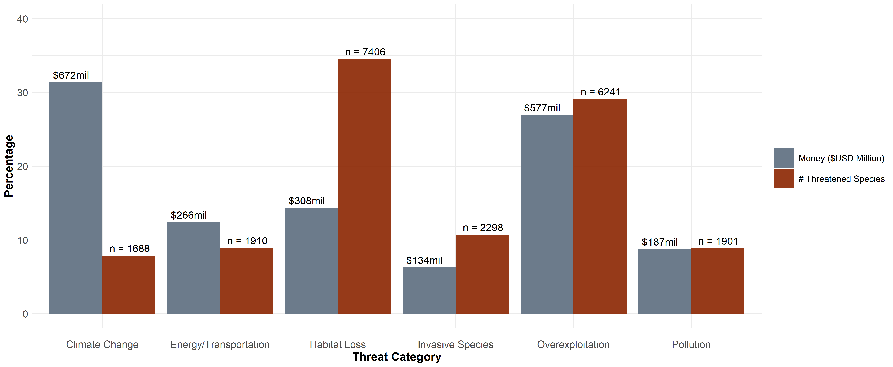
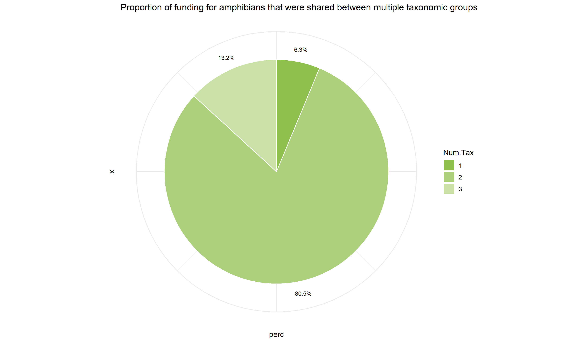
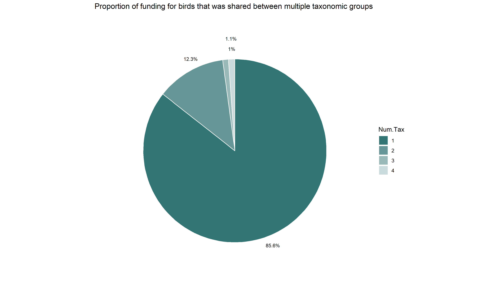
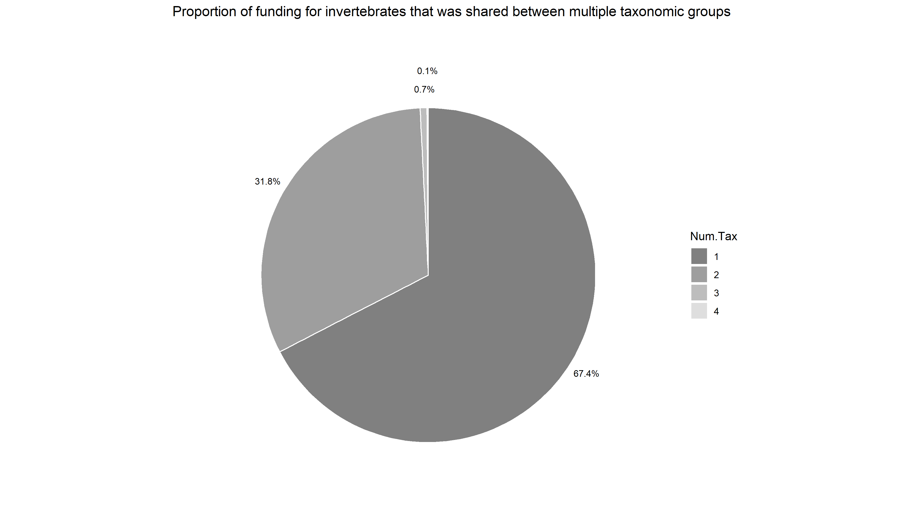
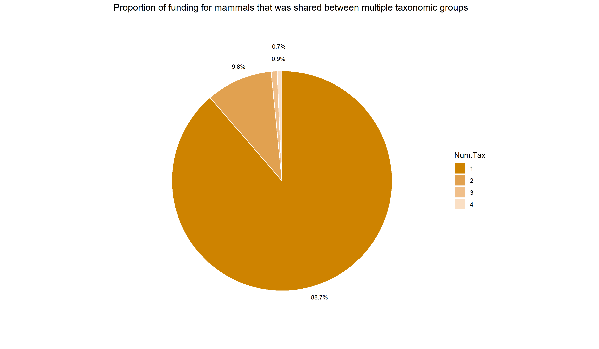
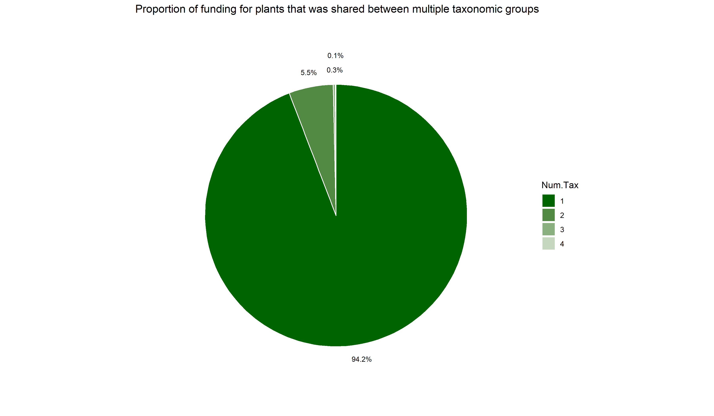

# Supplementary figures

This section deals with a few supplementary figures that were generated to highlight the validity of the analysis, irrespective of grants being classified simultaneously under multiple categories of threat and/or taxonomic groups.
```{r eval=TRUE}
# Load libraries
library(tidyverse)
library(scales)
library(ggsci)
```

## Import Data
```{r}
# Read in data of post-processed grants
data <- read_csv("data\\post-processed-grants-for-analysis-unique.csv") %>%
   as.data.frame() %>%
   dplyr::select(c(1:42, 49:109, 43:48))

data.multi <- read_csv("data\\post-processed-grants-for-analysis-multi.csv") %>%
  as.data.frame()
```

Preparing data to match our list of threat categories
```{r}
# Read in data on the number of species threatened (Maxwell et al. 2016)
maxwell.tab.s2 <- read_csv("data\\maxwell-tab-s2.csv") %>%
  as.data.frame()

maxwell.tab.s2$Abbreviated_clasfication

# Our threat categories: Climate Change, Habitat Loss, Overexploitation, Energy/Transportation, Pollution, Invasive Species

maxwell.data_threats <- maxwell.tab.s2 %>%
  dplyr::select(3:4) %>%
  group_by(Category) %>%
  summarise(Total = sum(n_species_threatened)) %>%
  mutate(Total.adjusted = replace(Total, Total %in% c(2132,11509), c(1910,7406)),
         adj.prop = Total.adjusted/Total,
         prop.total = Total.adjusted/sum(Total.adjusted))

# Habitat Loss and Energy/Transportation adjusted for compilation of multiple threats from Maxwell et al 2016. To do so, we looked at the number of species shared between threats and derived a conservative estimate accounting for overlap (species threatened by multiple threats).
```

Data on funding
```{r}
# Single-category Data
money.data <- data[,11:(length(data)-6)]*data[,7]
money.data <- mutate(money.data,
                         Year.Authorized = data$Year.Authorized,
                         Num.Thr = data$Num.Thr,
                         Num.Tax = data$Num.Tax)


# Multi-category Data
money.data.multi <- data.multi[,11:(length(data.multi)-6)]*data.multi[,7]
money.data.multi <- mutate(money.data.multi, 
                               Year.Authorized = data.multi$Year.Authorized,
                               Num.Thr = data.multi$Num.Thr,
                               Num.Tax = data.multi$Num.Tax)

by.year.money.multi <- money.data.multi %>%
  group_by(Year.Authorized) %>%
  summarize_at(vars(cat_act_area:cat_threat_pollution), sum, na.rm = TRUE) %>%
  pivot_longer(-Year.Authorized, names_to = "Category", values_to = "Amount") %>%
  group_by(Category) %>%
  mutate(percent = Amount/sum(Amount))

```

Categories used for analysis
```{r, echo = FALSE}
u.threat_cat <- names(data.multi)[37:42]

u.threat_list <- c("Climate Change", 
                   "Energy/Transportation",
                   "Habitat Loss",
                   "Invasive Species",
                   "Overexploitation",
                   "Pollution")
```

The above analysis was recreated using grants that were simultaneously classified into multiple threat categories. Please see Fig. S2 in the supplementary data. 
```{r}
fig.1a.money <- by.year.money.multi %>%
  filter(Category %in% u.threat_cat) %>%
  group_by(Category) %>%
  summarise(Total = sum(Amount))

rawFrame2 <- left_join(fig.1a.money, maxwell.data_threats, by = "Category") %>%
  mutate(rawMoney = Total.x) %>%   # Total Money
  mutate(rawSpecies = Total.adjusted) %>% # Total Species
  dplyr::select(Category, rawMoney, rawSpecies)

fig.1a.data <- left_join(fig.1a.money, maxwell.data_threats, by = "Category") %>%
  mutate(Money = (Total.x/sum(Total.x))*100) %>%   # Percentage of Total Money
  mutate(Species = (Total.adjusted/sum(Total.adjusted))*100) %>% # Percentage of Total Species
  dplyr::select(Category, Money, Species) %>%
  pivot_longer(c(Money, Species), names_to = "is.Money", values_to = "Amount") %>%
  left_join(rawFrame2, by = "Category") %>%
  mutate(rawMoney = ifelse(is.Money == "Species", NA, rawMoney)) %>%
  mutate(rawSpecies= ifelse(is.Money == "Money", NA, rawSpecies)) %>%
  replace_na(list(rawMoney = "", rawSpecies = "")) %>%
  unite("rawValue", rawMoney:rawSpecies, sep = "", remove = FALSE) %>%
  mutate(rawValue = as.numeric(rawValue),
         rawLabels = comma(rawValue))

fig.1a.data$rawLabels[c(seq(1,11,2))] <- str_glue("${round(rawFrame2$rawMoney/1e6)}mil")

fig.1a.data$rawLabels[c(seq(2,12,2))] <- str_glue("n = {rawFrame2$rawSpecies}")

fig.1a.plot <- ggplot(fig.1a.data, 
                      aes(fill=is.Money, 
                          y=Amount, 
                          x=Category)) + 
  geom_col(position="dodge") +
  labs(x="Threat Category", 
       y="Proportion") + 
  scale_x_discrete(labels=u.threat_list) +
  scale_fill_manual(values = c("slategray4", alpha("orangered4",.9)),
                    labels = c("Money (USD Million)", "Threatened Species")) +
  geom_text(position = position_dodge(width= 1), 
            aes(label = rawLabels, hjust = 0.55, vjust = -0.5), angle=0, size=5) +
  ylim(0, 40) +
  theme_minimal() +
  theme(axis.title = element_text(size = 16, face = "bold"), 
        axis.ticks.length.x = unit(.5, "cm"),
        axis.text = element_text(size = 14),
        legend.title = element_blank(),
        legend.key.size = unit(1,"cm"),
        legend.text = element_text(size = 12))

ggsave(fig.1a.plot, filename = "figs\\FigureS2-threat-mismatch-multiCategories.png", width=17, height=7,device=png(), units="in", dpi = 300)
```

```{r, eval=TRUE, fig.cap='Mismatch between conservation funding and drivers of biodiversity loss (including grants classified into multiple threat categories-Fig. S2)'}
# show exported image

```

While the proportion of funding allocated to certain taxonomic groups such as amphibians was limited, we sought to understand the proportion of funding that was shared between multiple taxonomic groups

Colors used for plots
```{r}
## Colors
cat_colors22 <- c("#990000", "#BF1E1E", "#993399", "#4C0099", "#000099",
                  "#2E10C3", "#3685B3", "#1AB3B3", "#8FC04F", "#09A256", 
                  "#006400", "#FFF928", "#C6C600", "#FFA200", "#CE8300", 
                  "#D0471E", "#9F8109", "#835506", "#317575", "#808080",
                  "black", "white")
barplot(1:22, col = cat_colors22, names.arg = 1:22)
```


Amphibians
```{r}
pie.Ntaxa_amphibian <- money.data.multi %>%
  filter(cat_taxa_amphibian > 0) %>%
  dplyr::select(Num.Tax, cat_taxa_amphibian) %>%
  mutate(Num.Tax = as.factor(Num.Tax)) %>%
  group_by(Num.Tax) %>%
  summarise(Total.money = sum(cat_taxa_amphibian)) %>%
  mutate(perc = Total.money/sum(Total.money))

plot.pie.Ntaxa_amphibian <- ggplot(pie.Ntaxa_amphibian,
                       aes(y = perc, 
                           x = "",
                           fill = Num.Tax)) +
  geom_bar(stat = "identity", color = "white") +
  theme_bw() +
  scale_fill_manual(values = seq_gradient_pal(cat_colors22[9], "white",
                                              "Lab")(seq(0,1, length.out = 5))) +
  labs(title="Proportion of funding for amphibians that was shared between multiple taxonomic groups") +
  coord_polar("y", start=0, direction = -1) +
  theme_void() +
  theme(axis.text.x = element_blank()) +
  geom_text(aes(x = 1.55,
                label = paste0(round(perc*100,1), "%")),
            position = position_stack(vjust = 0.5),
            size = 3,
            col = "black")

ggsave(plot.pie.Ntaxa_amphibian, filename = "figs\\fig_pie_amphibian.png", width=12, height=7, device=png(), units="in",dpi = 300)
```

```{r, eval=TRUE, fig.cap='Proportion of funding for amphibians that were shared between multiple taxonomic groups'}
# show exported image

```

Birds
```{r}
pie.Ntaxa_bird <- money.data.multi %>%
  filter(cat_taxa_bird > 0) %>%
  dplyr::select(Num.Tax, cat_taxa_bird) %>%
  mutate(Num.Tax = as.factor(Num.Tax)) %>%
  group_by(Num.Tax) %>%
  summarise(Total.money = sum(cat_taxa_bird)) %>%
  mutate(perc = Total.money/sum(Total.money))

plot.pie.Ntaxa_bird <- ggplot(pie.Ntaxa_bird,
                       aes(y = perc, 
                           x = "",
                           fill = Num.Tax)) +
  geom_bar(stat = "identity", color = "white") +
  theme_bw() +
  scale_fill_manual(values = seq_gradient_pal(cat_colors22[19], "white",
                                              "Lab")(seq(0,1, length.out = 5))) +
  labs(title="Proportion of funding for birds that was shared between multiple taxonomic groups") +
  coord_polar("y", start=0, direction = -1) +
  theme_void()+
  theme(axis.text.x = element_blank()) +
  geom_text(aes(x = c(rep(1.55, 3), 1.65),
                label = paste0(round(perc*100,1), "%")),
            position = position_stack(vjust = 0.5),
            size = 3,
            col = "black")

ggsave(plot.pie.Ntaxa_bird, filename = "figs\\fig_pie_bird.png", width=12, height=7,dpi = 300, device = png(), units="in")
```

```{r, eval=TRUE, fig.cap='Proportion of funding for birds that were shared between multiple taxonomic groups'}
# show exported image

```

Invertebrates
```{r}
pie.Ntaxa_invertebrate <- money.data.multi %>%
  filter(cat_taxa_invertebrate > 0) %>%
  dplyr::select(Num.Tax, cat_taxa_invertebrate) %>%
  mutate(Num.Tax = as.factor(Num.Tax)) %>%
  group_by(Num.Tax) %>%
  summarise(Total.money = sum(cat_taxa_invertebrate)) %>%
  mutate(perc = Total.money/sum(Total.money))

plot.pie.Ntaxa_invertebrate <- ggplot(pie.Ntaxa_invertebrate,
                       aes(y = perc, 
                           x = "",
                           fill = Num.Tax)) +
  geom_bar(stat = "identity", color = "white") +
  theme_bw() +
  scale_fill_manual(values = seq_gradient_pal(cat_colors22[20], "white",
                                              "Lab")(seq(0,1, length.out = 5))) +
  labs(title="Proportion of funding for invertebrates that was shared between multiple taxonomic groups") +
  coord_polar("y", start=0, direction = -1) +
  theme_void() +
  theme(axis.text.x = element_blank()) +
  geom_text(aes(x = c(rep(1.55, 3), 1.65),
                label = paste0(round(perc*100,1), "%")),
            position = position_stack(vjust = 0.5),
            size = 3,
            col = "black")

ggsave(plot.pie.Ntaxa_invertebrate, filename = "figs\\fig_pie_invertebrate.png", width=12, height=7,dpi = 300, device = png(), units="in")
```

```{r, eval=TRUE, fig.cap='Proportion of funding for invertebrates that were shared between multiple taxonomic groups'}
# show exported image

```

Fish
```{r}
pie.Ntaxa_fish <- money.data.multi %>%
  filter(cat_taxa_fish > 0) %>%
  dplyr::select(Num.Tax, cat_taxa_fish) %>%
  mutate(Num.Tax = as.factor(Num.Tax)) %>%
  group_by(Num.Tax) %>%
  summarise(Total.money = sum(cat_taxa_fish)) %>%
  mutate(perc = Total.money/sum(Total.money))

plot.pie.Ntaxa_fish <- ggplot(pie.Ntaxa_fish,
                       aes(y = perc, 
                           x = "",
                           fill = Num.Tax)) +
  geom_bar(stat = "identity", color = "white") +
  theme_bw() +
  scale_fill_manual(values = seq_gradient_pal(cat_colors22[7], "white",
                                              "Lab")(seq(0,1, length.out = 5))) +
  labs(title="Proportion of funding for fish that was shared between multiple taxonomic groups") +
  coord_polar("y", start=0, direction = -1) +
  theme_void()+
  theme(axis.text.x = element_blank()) +
  geom_text(aes(x = c(rep(1.55, 3), 1.65),
                label = paste0(round(perc*100,1), "%")),
            position = position_stack(vjust = 0.5),
            size = 3,
            col = "black")

ggsave(plot.pie.Ntaxa_fish, filename = "figs\\fig_pie_fish.png", width=12, height=7,dpi = 300, units="in", device=png())
```

```{r, eval=TRUE, fig.cap='Proportion of funding for fishes that were shared between multiple taxonomic groups'}
# show exported image
knitr::include_graphics("figs/fig_pie_fish.png")
```

Mammals
```{r}
pie.Ntaxa_mammal <- money.data.multi %>%
  filter(cat_taxa_mammal > 0) %>%
  dplyr::select(Num.Tax, cat_taxa_mammal) %>%
  mutate(Num.Tax = as.factor(Num.Tax)) %>%
  group_by(Num.Tax) %>%
  summarise(Total.money = sum(cat_taxa_mammal)) %>%
  mutate(perc = Total.money/sum(Total.money))

plot.pie.Ntaxa_mammal <- ggplot(pie.Ntaxa_mammal,
                       aes(y = perc, 
                           x = "",
                           fill = Num.Tax)) +
  geom_bar(stat = "identity", color = "white") +
  theme_bw() +
  scale_fill_manual(values = seq_gradient_pal(cat_colors22[15], "white",
                                              "Lab")(seq(0,1, length.out = 5))) +
  labs(title="Proportion of funding for mammals that was shared between multiple taxonomic groups") +
  coord_polar("y", start=0, direction = -1) +
  theme_void()+
  theme(axis.text.x = element_blank()) +
  geom_text(aes(x = c(rep(1.55, 3), 1.65),
                label = paste0(round(perc*100,1), "%")),
            position = position_stack(vjust = 0.5),
            size = 3,
            col = "black")

ggsave(plot.pie.Ntaxa_mammal, filename = "figs\\fig_pie_mammal.png", width=12, height=7,dpi = 300, units="in", device=png())
```

```{r, eval=TRUE, fig.cap='Proportion of funding for mammals that were shared between multiple taxonomic groups'}
# show exported image

```

Plants
```{r}
pie.Ntaxa_plant <- money.data.multi %>%
  filter(cat_taxa_plant > 0) %>%
  dplyr::select(Num.Tax, cat_taxa_plant) %>%
  mutate(Num.Tax = as.factor(Num.Tax)) %>%
  group_by(Num.Tax) %>%
  summarise(Total.money = sum(cat_taxa_plant)) %>%
  mutate(perc = Total.money/sum(Total.money))

plot.pie.Ntaxa_plant <- ggplot(pie.Ntaxa_plant,
                       aes(y = perc, 
                           x = "",
                           fill = Num.Tax)) +
  geom_bar(stat = "identity", color = "white") +
  theme_bw() +
  scale_fill_manual(values = seq_gradient_pal(cat_colors22[11], "white",
                                              "Lab")(seq(0,1, length.out = 5))) +
  labs(title="Proportion of funding for plants that was shared between multiple taxonomic groups") +
  coord_polar("y", start=0, direction = -1) +
  theme_void()+
  theme(axis.text.x = element_blank()) +
  geom_text(aes(x = c(rep(1.55, 3), 1.65),
                label = paste0(round(perc*100,1), "%")),
            position = position_stack(vjust = 0.5),
            size = 3,
            col = "black")

ggsave(plot.pie.Ntaxa_plant, filename = "figs\\fig_pie_plant.png", width=12, height=7,dpi = 300, units="in", device=png())
```

```{r, eval=TRUE, fig.cap='Proportion of funding for plants that was shared between multiple taxonomic groups'}
# show exported image

```

Reptiles
```{r}
pie.Ntaxa_reptile <- money.data.multi %>%
  filter(cat_taxa_reptile > 0) %>%
  dplyr::select(Num.Tax, cat_taxa_reptile) %>%
  mutate(Num.Tax = as.factor(Num.Tax)) %>%
  group_by(Num.Tax) %>%
  summarise(Total.money = sum(cat_taxa_reptile)) %>%
  mutate(perc = Total.money/sum(Total.money))

plot.pie.Ntaxa_reptile <- ggplot(pie.Ntaxa_reptile,
                       aes(y = perc, 
                           x = "",
                           fill = Num.Tax)) +
  geom_bar(stat = "identity", color = "white") +
  theme_bw() +
  scale_fill_manual(values = seq_gradient_pal(cat_colors22[17], "white",
                                              "Lab")(seq(0,1, length.out = 5))) +
  labs(title="Proportion of funding for reptiles that was shared between multiple taxonomic groups") +
  coord_polar("y", start=0, direction = -1) +
  theme_void()+
  theme(axis.text.x = element_blank()) +
  geom_text(aes(x = c(rep(1.55, 4)),
                label = paste0(round(perc*100,1), "%")),
            position = position_stack(vjust = 0.5),
            size = 3,
            col = "black")

ggsave(plot.pie.Ntaxa_reptile, filename = "figs\\fig_pie_reptile.png", width=12, height=7,dpi = 300, units="in", device=png())
```

```{r, eval=TRUE, fig.cap='Proportion of funding for reptiles that were shared between multiple taxonomic groups'}
# show exported image
knitr::include_graphics("figs/fig_pie_reptile.png")
```

## Threat Summary Figure (Fig. S4)
```{r}
unique_threat <- money.data %>%
  filter_at(vars(u.threat_cat), any_vars(.>0)) %>%
  dplyr::select(cat_threat_climate:cat_threat_pollution) %>%
  pivot_longer(1:6, names_to = "Category", values_to = "Money") %>%
  filter(Money > 0)

threats_violin <- ggplot(unique_threat, aes(x = Category, y = Money)) + 
  geom_violin(aes(col = Category, fill = Category)) + 
  geom_boxplot(width = 0.2) + 
  scale_color_manual(values = cat_colors22[c(1,13,11,20,5,18)]) +
  scale_fill_manual(values = cat_colors22[c(1,13,11,20,5,18)]) +
  scale_x_discrete(labels = u.threat_list) +
  scale_y_log10(labels = comma) +
  theme_minimal() +
  theme(legend.position = "none") +
  labs(x="Threat Category", 
       y="Grant Amount in USD (Log Scale)", 
       title="Distributions of Unique Threat Grant Amounts") 

# ggsave(threats_violin, filename = "figs\\threats_violin.png", width=12, height=7, dpi = 300)
```

```{r, eval=TRUE, fig.cap='Box and violin plots of the distributions of grant amounts for six drivers'}
# show exported image
knitr::include_graphics("figs/threats_violin.png")
```

### Summary statistics
```{r}
sum_table_threats <- money.data %>%
  select(u.threat_cat) %>%
  filter_all(any_vars(.>0)) %>%
  pivot_longer(1:6, names_to = "Category", values_to = "Money") %>%
  filter(Money > 0) %>%
  group_by(Category) %>%
  summarize(mn = mean(Money), 
            medn = median(Money),
            se = sd(Money)/sqrt(length(Money)))

sum_table_threats
```

